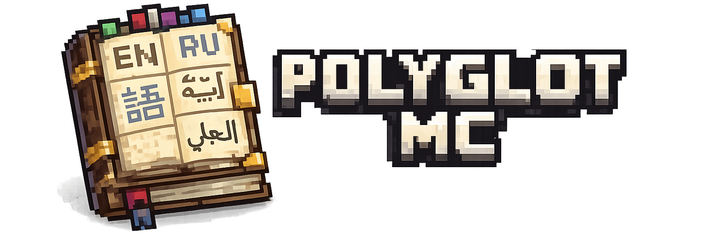

<p align="center">
  
</p>

<h1 align="center">POLYGLOT MC</h1>

<p align="center">
  <b>Version-aware Java library for translating Minecraft item names into multiple languages.</b>
</p>

<p align="center">
  <i>Because Minecraft items deserved to speak every language.</i>
</p>

---

## Overview

**PolyglotMC** is a lightweight Java library that provides **multilingual translations for Minecraft item names** across a wide range of **languages** and **Minecraft versions**.

The library fetches official Minecraft language assets, caches them efficiently, and exposes a clean API for translating names into human-readable localized strings.

---

## Features

- Supports **100+ Minecraft languages**
- Works across **many Minecraft versions**
- Automatic translation loading and caching

---

## Basic Usage

### Creating a Polyglot instance

```java
Polyglot polyglot = new Polyglot.Builder()
        .withVersion(SupportedVersion.Release.V1_20_4)
        .withLanguages(
                SupportedLanguage.EN_US,
                SupportedLanguage.RU_RU,
                SupportedLanguage.JA_JP
        )
        .withDefaultLanguage(SupportedLanguage.EN_US)
        .build();
```

### Translating an item

```java
TranslationResult result = polyglot.translate(Material.DIAMOND_SWORD, SupportedLanguage.RU_RU);

System.out.println(result.translatedName()); // Алмазный меч
```

### Dynamic Language Loading

```java
Polyglot polyglot = new Polyglot.Builder()
        .withVersion(SupportedVersion.Release.V1_21)
        .withLanguages(SupportedLanguage.EN_US)
        .withDynamicLanguageLoading(true)
        .build();
```

---